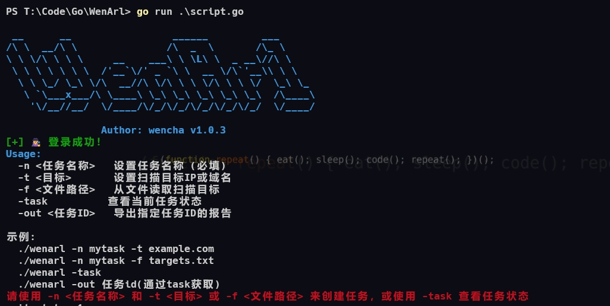
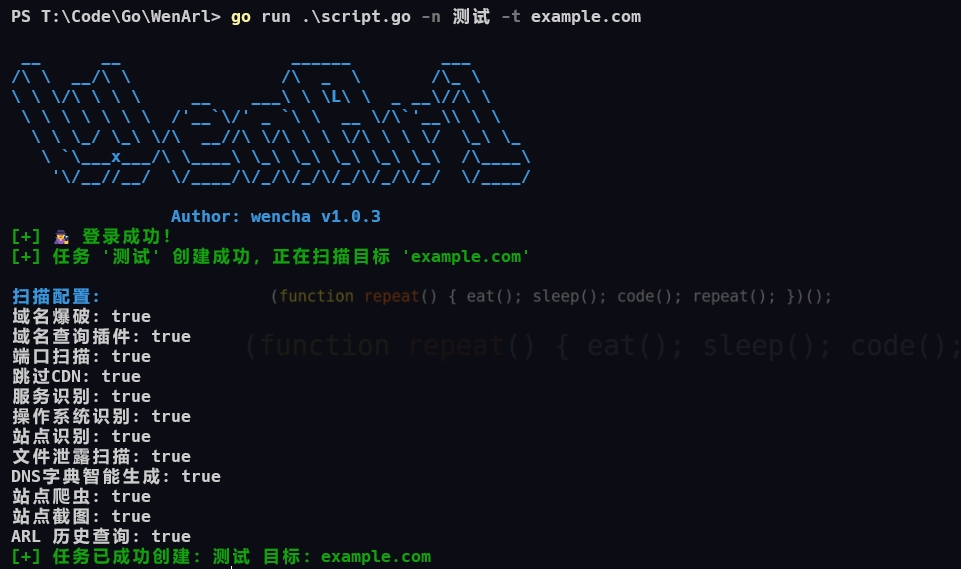
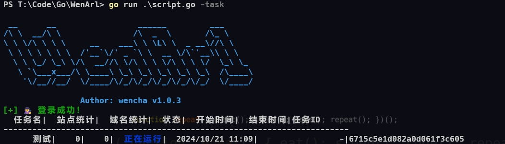
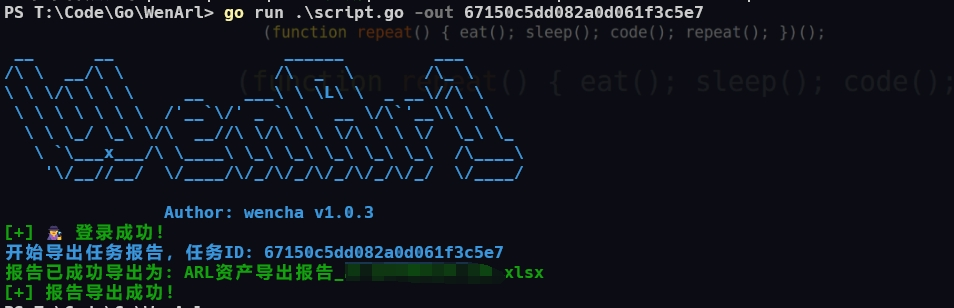

# WenARL

WenARL is a command-line tool designed to simplify and enhance the process of asset collection and scanning using ARL (Asset Reconnaissance & Leakage platform). This tool allows users to quickly submit scan tasks, monitor their progress, and export reports with ease, making asset collection more efficient and straightforward.

The main goal of this tool is to streamline asset discovery by allowing security professionals to easily interact with ARL without needing to manually navigate through the web interface. With WenARL, you can create, manage, and track scanning tasks through a simple and intuitive command-line interface (CLI).

## Purpose

The purpose of WenARL is to provide a more user-friendly way to interact with the ARL platform for asset discovery. It simplifies the submission of scan tasks and provides an easy way to view task statuses and export reports. This tool reduces manual effort and makes scanning more efficient by enabling quick task submissions and results retrieval directly from the terminal.

## Features

- **Domain Brute Force**: Perform large-scale domain brute force attacks to discover subdomains.
- **Port Scanning**: Identify open ports and services on target domains or IPs.
- **Service Detection**: Automatically detect services running on discovered open ports.
- **OS Detection**: Determine the operating system of the target based on network responses.
- **SSL Certificate Collection**: Gather SSL certificate details from target websites.
- **Site Identification**: Automatically identify various key characteristics of websites.
- **Web Information Hunter**: Collect detailed web information using advanced reconnaissance techniques.
- **ARL Historical Search**: Utilize ARL's historical data to gather more intelligence on targets.
- **DNS Query Plugin**: Perform detailed DNS queries to gather domain information.
- **Alternative DNS Generation (AltDNS)**: Generate alternative DNS records for additional analysis.
- **Skip CDN IP Scanning**: Skip scanning IPs belonging to CDNs to focus on more relevant targets.
- **Web Crawler (Spider)**: Automatically crawl websites to discover hidden information.
- **Website Screenshot Capture**: Capture screenshots of target websites for further review.
- **File Leak Detection**: Detect potential file leaks on target websites.
- **Virtual Host Detection**: Discover virtual hosts associated with the target.
- **Nuclei Vulnerability Scanning**: Integrates with Nuclei for vulnerability scanning.
- **Task Report Export**: Export detailed scan reports in Excel format for further analysis.
- **Concurrent Task Execution**: Execute multiple tasks concurrently to save time.

## Installation

1. **Clone the repository**:

   ```bash
   git clone https://github.com/your_username/wenarl.git
   cd wenarl
   ```

2. **Install dependencies**:

   ```bash
   go mod tidy
   ```

3. **Build the project**:

   ```bash
   go build -o wenarl main.go
   ```

4. **Set up the configuration file**:

   The first time you run the tool, a `config.json` file will be generated. You will need to modify this file with your ARL server details, username, and password:

   ```json
   {
     "server": "http://your-arl-server-address:5003",
     "username": "your-username",
     "password": "your-password",
     "domain_brute_type": "big",
     "port_scan_type": "all",
     "domain_brute": true,
     "alt_dns": true,
     "dns_query_plugin": true,
     "arl_search": true,
     "port_scan": true,
     "service_detection": true,
     "os_detection": true,
     "ssl_cert": false,
     "skip_scan_cdn_ip": true,
     "site_identify": true,
     "search_engines": true,
     "site_spider": true,
     "site_capture": true,
     "file_leak": true,
     "findvhost": true,
     "nuclei_scan": false,
     "web_info_hunter": false
   }
   ```

## Usage

### Command-line options:

| Option  | Description                                | Example Usage                          |
| ------- | ------------------------------------------ | -------------------------------------- |
| `-n`    | Set task name (Required for task creation) | `./wenarl -n task_name -t example.com` |
| `-t`    | Set target IP or domain                    | `./wenarl -n task_name -t 192.168.1.1` |
| `-f`    | Load targets from a file                   | `./wenarl -n task_name -f targets.txt` |
| `-task` | View the current status of tasks           | `./wenarl -task`                       |
| `-out`  | Export the report for a given task ID      | `./wenarl -out task_id`                |

### Example Commands

- **Creating a new task with a target domain**:

  ```bash
  ./wenarl -n "domain_scan" -t example.com
  ```

  

- **Creating a task from a file with multiple targets**:

  ```bash
  ./wenarl -n "multi_target_scan" -f targets.txt
  ```

  

- **Viewing the status of current tasks**:

  This command will list ongoing and completed tasks along with their statuses.

  ```bash
  ./wenarl -task
  ```

  

- **Exporting a task report**:

  Export the report of a specific task by task ID in Excel format.

  ```bash
  ./wenarl -out task_id
  
  ```




### Configuration Options

- **Domain Brute Force** (`domain_brute`): Enable domain brute forcing (`true` or `false`).
- **Port Scanning** (`port_scan`): Enable port scanning (`true` or `false`).
- **Service Detection** (`service_detection`): Detect services running on open ports.
- **OS Detection** (`os_detection`): Identify the operating system based on network responses.
- **SSL Certificate Collection** (`ssl_cert`): Collect SSL certificate information from target websites.
- **Skip CDN IP Scanning** (`skip_scan_cdn_ip`): Skip scanning IPs that belong to CDNs.
- **Web Crawling (Spider)** (`site_spider`): Enable web crawling to extract site data.
- **Web Screenshot Capture** (`site_capture`): Enable automatic screenshot capture of websites.

## Example `config.json`

```json
{
  "server": "http://your-arl-server-address:5003",
  "username": "your-username",
  "password": "your-password",
  "domain_brute_type": "big",
  "port_scan_type": "all",
  "domain_brute": true,
  "alt_dns": true,
  "dns_query_plugin": true,
  "arl_search": true,
  "port_scan": true,
  "service_detection": true,
  "os_detection": true,
  "ssl_cert": false,
  "skip_scan_cdn_ip": true,
  "site_identify": true,
  "search_engines": true,
  "site_spider": true,
  "site_capture": true,
  "file_leak": true,
  "findvhost": true,
  "nuclei_scan": false,
  "web_info_hunter": false
}
```

## License

This project is licensed under the MIT License - see the [LICENSE](LICENSE) file for details.
